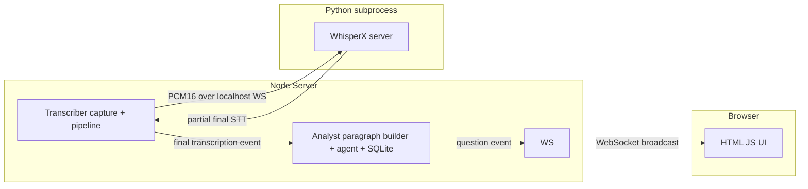

<div align="center">

# 🧠 Roofle

**An intelligent meeting copilot that analyzes your conversations in real time
and helps you improve your presentations, communication, and meetings.**

[](LICENSE)
[](package.json)
[](#prerequisites)

</div>

---

## ✨ What is Roofle?

Roofle is an **intelligent meeting copilot** that analyzes your conversations in
real time and helps you improve your presentations, communication, and meetings.

It captures your microphone and system audio, transcribes it **locally** with
WhisperX, and runs an LLM analyst that surfaces clarifying questions and
feedback in real time — all while you speak.

Everything runs on your machine. Your audio never leaves it.

---

## 🚀 Features

- 🔒 **Local & private** — audio is transcribed on-device, nothing is uploaded.
- 🎙️ **Microphone + system audio** capture via a native ScreenCaptureKit addon.
- 💬 **Real-time subtitles** streamed to the browser over WebSocket.
- 🧠 **LLM analyst** that asks clarifying questions as you talk.
- 🧩 **Runs as a local app** — a single Node server serves the UI and streams
  live results to your browser, no install or setup required.

---

## 🏗️ Architecture

Roofle is a **local web app**: a Node server runs on your machine, serves the UI
over HTTP, and pushes live transcriptions and questions to the browser over
WebSocket.

```
Node server (localhost:8080)
 ├─ serves the HTML/JS UI over HTTP
 ├─ spawns Python WhisperX server (managed subprocess, localhost WebSocket)
 ├─ runs Transcriber capture pipeline (native ScreenCaptureKit addon)
 ├─ runs Analyst (paragraph builder + LangGraph agent + SQLite)
 └─ pushes transcriptions + questions to the browser over WebSocket
```



---

## 📦 Project layout

```
roofle/
├── package.json                 # npm workspaces + root scripts
├── packages/
│   ├── shared/                  # typed contracts (TranscriptionEvent, QuestionEvent, SttMessage)
│   ├── transcriber/             # audio capture + pipeline + WhisperX server
│   ├── analyst/                 # LangGraph agent + SQLite
│   └── app/                     # Node HTTP + WebSocket server + browser UI
```

---

## ✅ Prerequisites

- **macOS 13.0+** (ScreenCaptureKit)
- **Node.js ≥ 22.5** (analyst uses `node:sqlite`)
- **Xcode Command Line Tools** (native addon)
- **Python 3.10+** (installed automatically into a venv by `npm install`)

---

## ⚡ Quick start

```bash
# 1. Install everything. `npm install` compiles the native addon AND creates a
#    Python virtualenv with the WhisperX requirements (via the postinstall hook).
npm install

# 2. Configure the LLM provider
cp packages/app/.env.example packages/app/.env
# set OPENROUTER_API_KEY (or switch provider to ollama in packages/analyst/config.json)

# 3. Run the app
npm run dev
```

Then open **http://127.0.0.1:8080** in your browser to see live subtitles.

> ⚠️ **macOS permissions:** grant **Screen Recording** and **Microphone** access
> to the app you run from (e.g. Terminal or VS Code), then restart it. The
> permission only takes effect on restart.

---

## 🛠️ Scripts

| Command | Description |
| --- | --- |
| `npm run dev` | Build all packages and start the Node server (tsx) |
| `npm run start` | Build all packages and start the compiled server |
| `npm run build` | Compile all TypeScript packages |
| `npm run typecheck` | Type-check all packages |
| `npm run test` | Run transcriber unit tests |

---

## ⚙️ Configuration

Roofle is configured through two `.env` files (copy the `.env.example` templates
and fill in your values) plus a couple of JSON configs:

- **App env** — [`packages/app/.env.example`](packages/app/.env.example) → `packages/app/.env`
- **Transcriber env** — [`packages/transcriber/.env.example`](packages/transcriber/.env.example) → `packages/transcriber/.env`
- **LLM + analysis** — [`packages/analyst/config.json`](packages/analyst/config.json)
- **Audio / STT / VAD** — [`packages/transcriber/config.json`](packages/transcriber/config.json)

### App env (`packages/app/.env`)

| Variable | Default | Description |
| --- | --- | --- |
| `OPENROUTER_API_KEY` | — | API key for the LLM analyst (required unless you switch to a local provider like Ollama in `config.json`) |
| `WHISPER_MODEL` | `base` | Whisper model size used by the Python server |
| `WHISPER_DEVICE` | `cpu` | Device for Whisper inference (`cpu` or `cuda`) |
| `WHISPER_COMPUTE_TYPE` | `int8` | Compute type for the model |
| `PYTHON_BIN` | *(venv)* | Optional override for the Python interpreter used to launch the WhisperX server |
| `CAPTURE_MICROPHONE` | `true` | Capture the microphone |
| `CAPTURE_SYSTEM_AUDIO` | `true` | Capture system (speaker) audio |
| `CAPTURE_APPS` | *(list)* | Comma-separated app names to capture system audio from |

### Transcriber env (`packages/transcriber/.env`)

| Variable | Default | Description |
| --- | --- | --- |
| `STT_WS_URL` | `ws://127.0.0.1:9000` | WebSocket URL of the WhisperX STT server |
| `STT_WS_TOKEN` | — | Optional auth token for the STT server |
| `CAPTURE_APPS` | *(list)* | Comma-separated app names to capture |
| `CAPTURE_MICROPHONE` / `CAPTURE_SYSTEM_AUDIO` | `true` | Toggle mic / system audio capture |
| `VAD_ENABLED` | `true` | Skip silence before sending to STT |
| `ECHO_SUPPRESSION_ENABLED` | `true` | Mute the mic while system audio plays to avoid echo |
| `LOG_METRICS` | `false` | Log full STT JSON payload + periodic metrics |
| `WINDOW_SECONDS` | `4` | Rolling window fed to the model (smaller = faster) |
| `TRANSCRIBE_INTERVAL_MS` | `100` | How often the server attempts inference |
| `MIN_AUDIO_SECONDS` | `0.3` | Minimum buffered audio before inference runs |
| `VAD_THRESHOLD` | `0.01` | RMS below this is treated as silence |
| `PAUSE_FINALIZE_MS` | `400` | Silence gap after which a phrase is finalized |

### Whisper model

The model is set via `WHISPER_MODEL` (default `base`) in the app env. The Node
server spawns the Python server with this value.

---

## ⚠️ Known limitations

- Whisper alignment is hardcoded to English (`language_code="en"`).
- The analyst uses `node:sqlite` (Node 22.5+).
- System-audio capture requires the native ScreenCaptureKit addon and macOS
  Screen Recording permission (granted to the terminal/Node process).

---

## 🤝 Contributing

Contributions are welcome! Please read the
[contributing guidelines](CONTRIBUTING.md) and our
[code of conduct](CODE_OF_CONDUCT.md) before getting started.

## 🔐 Security

Found a security issue? Please report it privately — see
[SECURITY.md](SECURITY.md).

## 📄 License

[MIT](LICENSE) © Roofle contributors
