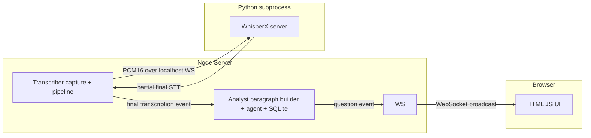

# Roofle

[](LICENSE)
[](package.json)
[](#prerequisites)

A single-user macOS app that captures microphone + system audio, transcribes it
locally with WhisperX, and runs an LLM analyst that surfaces clarifying
questions in real time.

This is a monorepo consolidation of two previously separate services:

- **`transcriber`** — audio capture + WhisperX transcription (TypeScript + Python).
- **`analyst`** — LangGraph LLM agent that builds paragraphs and generates questions.

The two were previously connected over **Kafka** and a **browser WebSocket**.
Since this is a single-user app with no parallel users, both are removed: the
transcriber and analyst now run **in the same Node process** and communicate
over an in-process event bus.

## Features

- **Local, private transcription** — audio never leaves your machine.
- **Microphone + system audio** capture via the native ScreenCaptureKit addon.
- **Real-time subtitles** streamed to the browser over WebSocket.
- **LLM analyst** that surfaces clarifying questions as you speak.
- **No `.app` bundle** — runs as a plain Node server, so there are no Apple
  code-signing, Gatekeeper, or XProtect issues.

## Architecture

The app is a **local web app**: a Node server runs on your machine, serves the
UI over HTTP, and pushes live transcriptions/questions to the browser over
WebSocket.

```
Node server (localhost:8080)
 ├─ serves the HTML/JS UI over HTTP
 ├─ spawns Python WhisperX server (managed subprocess, localhost WebSocket)
 ├─ runs Transcriber capture pipeline (native ScreenCaptureKit addon)
 ├─ runs Analyst (paragraph builder + LangGraph agent + SQLite)
 └─ pushes transcriptions + questions to the browser over WebSocket
```



## Monorepo layout

```
roofle/
├── package.json                 # npm workspaces + root scripts
├── packages/
│   ├── shared/                  # typed contracts (TranscriptionEvent, QuestionEvent, SttMessage)
│   ├── transcriber/             # audio capture + pipeline + WhisperX server
│   ├── analyst/                 # LangGraph agent + SQLite (migrated to TS)
│   └── app/                     # Node HTTP + WebSocket server + browser UI
```

## Prerequisites

- **macOS 13.0+** (ScreenCaptureKit)
- **Node.js ≥ 22.5** (analyst uses `node:sqlite`)
- **Xcode Command Line Tools** (native addon)
- **Python 3.10+** (installed automatically into a venv by `npm install`)

## Quick start

```bash
# 1. Install everything. `npm install` compiles the native addon AND creates a
#    Python virtualenv with the WhisperX requirements (via the postinstall hook).
npm install

# 2. Configure the LLM provider
cp packages/app/.env.example packages/app/.env
# set OPENROUTER_API_KEY (or switch provider to ollama in packages/analyst/config.json)

# 3. Run the app
npm run dev
```

Then open **http://127.0.0.1:8080** in your browser to see live subtitles.

> **macOS permissions:** grant **Screen Recording** and **Microphone** access to
> the app you run from (e.g. Terminal or VS Code), then restart it. The
> permission only takes effect on restart.

## Scripts

| Command | Description |
| --- | --- |
| `npm run dev` | Build all packages and start the Node server (tsx) |
| `npm run start` | Build all packages and start the compiled server |
| `npm run build` | Compile all TypeScript packages |
| `npm run typecheck` | Type-check all packages |
| `npm run test` | Run transcriber unit tests |

## Configuration

- **LLM + analysis** — [`packages/analyst/config.json`](packages/analyst/config.json)
- **Audio / STT / VAD** — [`packages/transcriber/config.json`](packages/transcriber/config.json)
- **App env** — [`packages/app/.env.example`](packages/app/.env.example)

### Whisper model

The model is set via `WHISPER_MODEL` (default `base`) in the app env. The Node
server spawns the Python server with this value.

## What was removed

- **Kafka** (`kafkajs`) — the transcriber→analyst and analyst→UI round-trip is
  now an in-process event bus with shared typed contracts.
- **Electron** — replaced with a plain Node HTTP + WebSocket server, so there is
  no `.app` bundle and no Apple code-signing requirement.
- The **localhost WebSocket to Python** remains, since WhisperX must run as a
  separate Python process.

## Known limitations

- Whisper alignment is hardcoded to English (`language_code="en"`).
- The analyst uses `node:sqlite` (Node 22.5+).
- System-audio capture requires the native ScreenCaptureKit addon and macOS
  Screen Recording permission (granted to the terminal/Node process).

## Contributing

Contributions are welcome! Please read the
[contributing guidelines](CONTRIBUTING.md) and our
[code of conduct](CODE_OF_CONDUCT.md) before getting started.

## Security

Found a security issue? Please report it privately — see
[SECURITY.md](SECURITY.md).

## License

[MIT](LICENSE) © Roofle contributors
