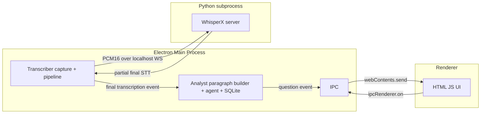

# Monorepo Architecture Plan: Transcriber + Analyst → Single Electron App

## Goal

Combine `my-transcriber` (WhisperX transcription) and `my-analyst` (LLM research
agent) into a single macOS desktop app. Run everything with one command. Remove
the Kafka round-trip and the browser WebSocket, since this is a single-user app
with no parallel users.

## Decisions (confirmed with user)

- **Shell:** Electron, reusing the existing HTML/JS UI in a BrowserWindow. The
  Node main process runs capture + analyst in-process. Native ScreenCaptureKit
  addon works as-is.
- **STT transport:** Keep localhost WebSocket to the Python WhisperX server,
  but spawn it as a managed subprocess from the single command.
- **Language:** Migrate the analyst from CommonJS JS to TypeScript to unify
  with the transcriber and share typed contracts.

## Current vs Target

### Current (two services, Kafka round-trip)

```
Transcriber → Kafka(transcriptions) → Analyst → Kafka(questions) → Transcriber → Browser WS → UI
```

### Target (single Electron app, in-process)

```
Electron main process
 ├─ spawns Python WhisperX server (managed subprocess, localhost WS)
 ├─ runs Transcriber capture pipeline (native addon)
 ├─ runs Analyst (paragraph builder + LangGraph agent + SQLite)
 └─ forwards transcriptions + questions to renderer via Electron IPC
```



## What gets removed

- **Kafka** (`kafkajs`): `KafkaPublisher`, `KafkaConsumer`, `QuestionProducer`,
  topic auto-creation, all `kafka.*` / `questions.*` config.
- **Browser WebSocket** (`ws` server): `TranscriptionServer` HTTP+WS server.
  The renderer talks to main over Electron IPC instead.
- **`ws` client to Python** stays (per decision), but the Python server is now
  spawned and managed by the app rather than started manually.

## Proposed monorepo layout

```
roofle/
├── package.json                 # npm workspaces + root scripts (dev/start/build)
├── tsconfig.base.json
├── packages/
│   ├── shared/                  # typed contracts (TranscriptionEvent, QuestionEvent, SttMessage)
│   │   └── src/index.ts
│   ├── transcriber/             # from my-transcriber (TS, native addon, capture pipeline)
│   │   ├── src/...
│   │   ├── native/              # ScreenCaptureKit addon
│   │   ├── binding.gyp
│   │   └── whisper/             # Python WhisperX server (moved here)
│   ├── analyst/                 # from my-analyst, migrated to TS
│   │   └── src/...
│   └── app/                     # Electron main + preload + renderer
│       ├── src/main.ts          # wires transcriber + analyst, spawns Python
│       ├── src/preload.ts
│       └── ui/                  # existing HTML/JS UI
```

## Implementation steps

1. **Scaffold monorepo** — root `package.json` with npm workspaces; move
   transcriber, analyst, whisper, and ui into the layout above; add
   `packages/shared`.

2. **Create shared contracts** — `packages/shared/src/index.ts` defining:
   - `TranscriptionEvent` (type, sessionId, sequence, text, start, end, source, timestampMs)
   - `QuestionEvent` (sessionId, source, id, question, status)
   - `SttMessage` (partial/final/ready/error shapes)
   These become the single source of truth for both packages.

3. **Migrate analyst to TypeScript** — convert `src/**` (db, llm, agent,
   services, models) to TS with a `tsconfig`. Keep behavior identical. Replace
   `kafka/consumer.js` + `kafka/producer.js` with an in-process ingest API.

4. **Remove Kafka from transcriber** — replace `KafkaPublisher` with an
   in-process event emitter/callback that emits `TranscriptionEvent`s on each
   `final` STT message.

5. **Remove Kafka from analyst** — replace `KafkaConsumer` with
   `ingest(transcription)` and `QuestionProducer` with an `onQuestion` callback.

6. **Remove browser WebSocket** — delete `TranscriptionServer`; forward
   transcriptions/questions to the renderer over Electron IPC.

7. **Electron main process** — wire transcriber + analyst together, spawn the
   Python WhisperX server as a managed subprocess, handle lifecycle/shutdown.

8. **Preload + IPC bridge + UI** — add preload exposing a safe IPC API; update
   the HTML/JS UI to consume transcriptions/questions over IPC instead of WS.

9. **Single-command orchestration** — root scripts (`dev`/`start`/`build`) that
   build the native addon, start the Python server, and launch Electron.

10. **Native addon + packaging** — configure `electron-rebuild` for the
    ScreenCaptureKit addon and add `electron-builder` config for macOS.

11. **Docs & cleanup** — update README/docs; remove obsolete Kafka/WebSocket
    config and dependencies.

## Whisper model management

The WhisperX model is loaded **once at process startup** from the `MODEL` env
var (default `base`), plus `DEVICE` (`cpu`) and `COMPUTE_TYPE` (`int8`). The
single `Transcriber` instance is shared across all WebSocket connections, and
the alignment model is hardcoded to English (`language_code="en"`).

Implications for the new architecture:

- **First run downloads the model** — the app must surface model-loading
  progress to the UI and not appear hung during the initial download.
- **Runtime model switching is not supported today** — the model is fixed at
  startup. To let the user change models (e.g. `base` → `large-v3`) from the
  UI, add a `set_model` command to the WebSocket protocol so the Python server
  reloads the model in place without restarting the subprocess or dropping the
  session. The Electron main process forwards the user's model choice to the
  Python server over the existing WebSocket.
- **English-only alignment** — the alignment model and `transcribe(...,
  language="en")` are hardcoded. Multi-language support is out of scope for
  this consolidation but should be noted as a known limitation.

## Notes / risks

- **Python subprocess lifecycle** — must be spawned before capture starts and
  torn down on app quit; handle port conflicts and crash-restart.
- **Native addon in Electron** — requires `electron-rebuild` so the
  ScreenCaptureKit addon is ABI-compatible with Electron's Node.
- **macOS permissions** — Screen Recording + Microphone permissions now apply
  to the Electron app bundle, not the terminal.
- **SQLite** — analyst uses `node:sqlite` (Node 22.5+); Electron's bundled Node
  must be ≥ 22.5 or the DB layer needs a fallback.
- **Model load latency** — the Python subprocess blocks on model load before
  accepting connections; the app should start capture only after the server
  reports `ready`.
