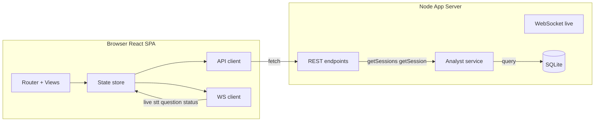

# Roofle UI Architecture: Questions + Transcriptions with History

## Scope

Build a professional UI for Roofle covering **questions** and **transcriptions**
only. Analysis and Q&A are explicitly out of scope for now.

Requirements:
1. Professional, polished UI.
2. **Questions** shown by default — live and from **previous conversations**.
3. **Transcription** toggleable in the UI, hidden by default.
4. Users can browse past conversations (sessions) and see their questions and
   transcriptions.

## Current state (verified)

- **Serving:** `packages/app/src/server.ts` is a plain Node `http` server
  serving static files from `packages/app/ui` (no UI build step) + a WebSocket
  pushing live `stt`, `question`, `status` events.
- **Session model:** `packages/transcriber/src/app/audio-streaming-app.ts` sets
  `sessionId = conv-${Date.now()}` — one session per app run.
- **Persistence (SQLite):** `packages/analyst/src/db/database.ts` has `streams`,
  `paragraphs`, `questions` tables. Read API is minimal (`getOpenQuestions`,
  `getQuestionsByIds`). No session listing or full-session read.
- **Analyst:** `packages/analyst/src/index.ts` exposes `ingest()` + `onQuestion`
  callback.
- **UI:** questions only arrive live over WebSocket; nothing fetched on load.

## Decision: UI framework

**Adopt React + Vite + TypeScript.**

Rationale:
- Multiple views (Live, Library, Session detail) and shared state justify a
  framework; vanilla JS becomes hard to maintain.
- Vite provides a dev server and a production build the Node server serves as
  static assets.
- TypeScript unifies with the monorepo and lets us share contracts from
  `@roofle/shared`.

### Build/serve model

- Add a React + TS Vite app under `packages/app/ui`.
- `vite build` outputs to `packages/app/ui/dist`.
- The Node server serves `ui/dist` for static files and keeps the WebSocket for
  live events. REST endpoints serve persisted data.
- Root scripts: build UI then start the server; add a `dev:ui` script for hot
  reload during development.

## Architecture



### Layered boundaries (no holes)

- `server.ts` (HTTP/WS layer) → `Analyst` (service layer) → `SqliteClient`
  (data layer) → SQLite. HTTP handlers never touch SQLite directly.
- UI talks only to REST + WS, never to the DB.

## Data model additions (`database.ts`)

New table:

```
sessions (
  id TEXT PRIMARY KEY,          -- conv-<timestamp>
  started_at TEXT NOT NULL,
  updated_at TEXT NOT NULL
)
```

New read queries:
- `getSessions()` — list sessions with last activity + question count.
- `getSession(sessionId)` — session + its paragraphs (transcription) + questions.

## Analyst API additions (`index.ts`)

- `getSessions(): SessionSummary[]`
- `getSession(sessionId): SessionDetail` — transcription (paragraphs) + questions.
- Keep existing `ingest()` + `onQuestion` for live capture.

## REST endpoints (`server.ts`)

- `GET /api/sessions` → `{ sessions: SessionSummary[] }`
- `GET /api/sessions/:id` → `{ session: SessionDetail }`
- Route these **before** the static-file fallback. Add `application/json` MIME
  (already present).

## UI structure (React SPA)

```
packages/app/ui/
├── index.html
├── vite.config.ts
├── package.json
└── src/
    ├── main.tsx
    ├── App.tsx                 # router + layout
    ├── api/client.ts           # fetch wrappers
    ├── ws/client.ts            # live WebSocket
    ├── store/                  # state (context or zustand)
    ├── components/
    │   ├── Layout.tsx          # header, toolbar, nav
    │   ├── StatusPill.tsx
    │   ├── Toggle.tsx
    │   └── QuestionCard.tsx
    └── views/
        ├── LiveView.tsx        # live transcription (toggle) + live questions
        ├── LibraryView.tsx     # list of past sessions
        └── SessionView.tsx     # session detail: transcription + questions
```

### Views

- **Live** (default): Questions panel (default shown) + Transcription panel
  (toggleable, hidden by default). Live WS events update state.
- **Library**: list of past conversations (sessions) with timestamps and
  question counts. Clicking opens Session view.
- **Session**: full transcription + questions (with status) for a past session.

### State

- `sessions: SessionSummary[]`
- `activeSessionId: string`
- `questions: Map<sessionId, QuestionEvent[]>` (history + live merged by
  `(sessionId, id)`)
- `transcripts: { microphone, system }` (live)

## Implementation steps

1. **Scaffold React + Vite UI** in `packages/app/ui` (package.json, vite config,
   tsconfig, index.html, main.tsx, App.tsx).
2. **DB layer** — add `sessions` table + `getSessions`, `getSession` queries.
3. **Analyst API** — add `getSessions`, `getSession`.
4. **REST endpoints** — add the two routes to `server.ts`; serve `ui/dist`.
5. **UI: Live view** — port current design (questions default, transcription
   toggleable) into React; wire WS.
6. **UI: Library + Session views** — session list + detail with transcription +
   questions.
7. **Build wiring** — root scripts build UI then serve; typecheck.
8. **Verify** — `npm run typecheck`, `npm run build`, manual smoke test.

## Out of scope / notes

- No analysis, no Q&A (deferred).
- `sessionId` is `conv-<timestamp>`; derive a human label from `started_at`.
- Live questions merge with history by `(sessionId, id)` to avoid duplicates.
- The `sessions` table is populated on first ingest for a new session id.
